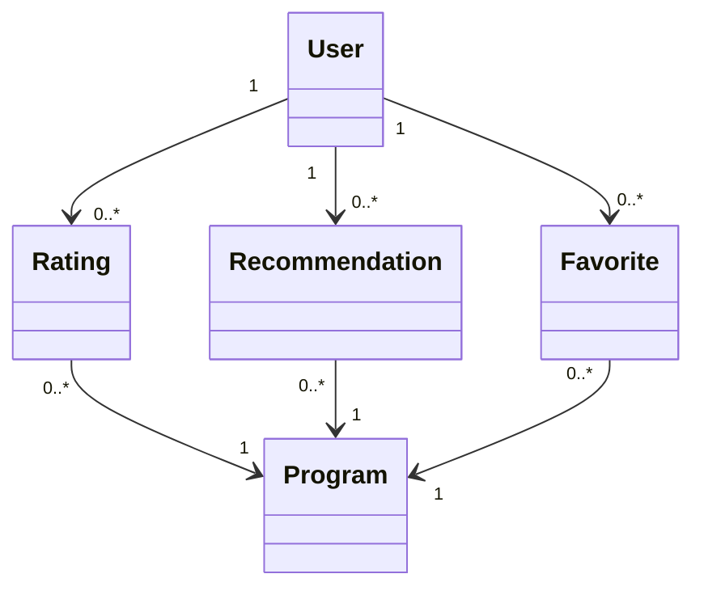

# SP3-Store-Systemer: MyDRTV Solution Architecture Report

## Group Members: Jamie, Markus Isak & Helena

## Introduction
This report presents the proposed solution architecture and technology stack for the MyDRTV project, a digital transformation initiative for Denmark’s state broadcaster. The platform aims to promote Danish TV and film globally by offering access to a vast collection of old TV programs and films. Key features include user ratings, advanced search, personalized recommendations, and GDPR-compliant user interaction.

The report outlines our systematic approach to selecting the technology stack and architecture, comparing different architectural styles like layered and microservices. The architecture design will be supported by diagrams, including use case, domain model, and sequence diagrams.

## Project Overview

### Objective
The MyDRTV platform is designed to provide:
- Access to a global audience for Danish TV and films.
- User accounts with rating and interaction features.
- Advanced search capabilities based on year, title, genre, and other filters.
- Personalized recommendations through a "More Programs You May Like" feature.
- High availability and compliance with GDPR for handling personally identifiable information (PII).

### Key Functional Requirements
- **User Interaction:** Account creation, ratings, and conversations on TV programs and films.
- **Search System:** Advanced search using multiple filters such as year of production, title, and genre.
- **Personalization:** A recommendation system based on user ratings and interaction.
- **High Availability:** Ensuring uninterrupted global access to content.
- **GDPR Compliance:** Secure handling of PII with compliance to European regulations.

## Architectural Approach

### Architectural Styles Comparison
We considered a few architectural styles for the MyDRTV project.

When looking at the project briefing document, selecting the right architectural approach is challenging. After careful consideration, we decided to go with a **layered architecture** that treats the application like a monolith. The reasoning behind this choice is based on our team’s experience and familiarity with this style. A layered approach allows us to focus on delivering the core features efficiently while maintaining simplicity during the initial stages of development.

The platform is described as a global streaming service for Danish movies and TV shows, designed to reach audiences worldwide. However, given that we anticipate the majority of users will be in Denmark—at least initially—starting with microservices seemed like an unnecessary overhead in terms of cost and complexity. Microservices come with significant operational costs, such as managing multiple services, handling communication overhead, and potentially requiring a dedicated DevOps team. A monolithic, layered architecture reduces these costs, especially if global scaling isn’t an immediate concern.

That said, we recognize the potential for the platform to grow and gain popularity outside Denmark. A monolith might struggle with global performance if this happens, but we plan to extend its life by introducing optimizations like **caching** or improving database performance (using PostgreSQL's JSON support, for example). **Caching** solutions, such as **Redis** or **Memcached**, will be used to optimize data retrieval for high-traffic features like the advanced search or personalized recommendations, ensuring faster response times for users regardless of location.

In addition, we’re designing the system with **modularity** in mind to minimize potential issues with tight coupling. By ensuring clear **separation of concerns** between different layers (Presentation, Business Logic, Data), we can isolate components and make them easier to refactor or even extract into microservices later. For example, we could develop the **recommendation engine** as an independent module, even within the monolith, so that it can scale separately if needed.

To further future-proof the architecture, we’ll consider implementing **event-driven communication** between subsystems. This would allow us to decouple critical services like the rating system and recommendation engine from the core application, making it easier to transition these into microservices later without heavy refactoring. Using an event bus, for instance, would allow different components to communicate asynchronously through events like “user rated a film” or “user watched a title,” which can then trigger other processes such as personalized recommendations.

Finally, we also have the option of **scaling the database** using PostgreSQL’s partitioning or sharding capabilities, should user data or content search volumes increase significantly. With this, the platform can manage large amounts of data efficiently, supporting scalability for global users.

So with all that in mind our **conclusion** was that the **layered architecture** would provide a manageable, cost-effective foundation for the MyDRTV platform in its initial phase, with clear pathways for growth if the user base expands globally. We acknowledge that there are risks—primarily in terms of performance scaling—but the architecture is well-suited to the initial audience. By focusing on **modularity**, **decoupling**, and **future-proofing** strategies, we ensure flexibility to transition to microservices when the demand justifies it.

## Technology Stack

- **Frontend:** Typescript React. This choice was made over Javascript because we while we prefer a strongly typed language we also feel it provides better tooling than Javascript. React was chosen as our design library because of how dynamic it makes coding applications, because of our familiarity with the technology. Also out of the box, TypeScript supports JSX and which allows us to get the full React Web support that we want.

- **Backend:** We chose C# because it's object-oriented and utilizes .NET which provides access to Entity Framework (EF). EF is an object-relational mapper (ORM) that simplifies performing CRUD operations on a relational database. While other programming langauges also offer the use of ORMs, such as JPA for Java, We prefer EF for its ease of use and intuitive design.

- **Database:** We believe PostgreSQL is a suitable choice because it is a relational database and we find it simple to use, Postgres is also known for its scalability and ability to handle large-scale data. It also offers JSON support giving us the flexibility we want combined with a decent community support, making this a dependable choice for managing our data needs we'd say.

- **Search Engine:** PostgreSQL already has a built-in full-text search engine, which we plan to use to use for the streaming service. It allows efficient searching throuhg large vollumes of text data, such as movie titles, metadata etc. Supports advanced phrase searching, ranking results by relevance, and filtering by specific fields, which will help users find content accurately and quickly. But if our choice turns out to not be efficient enough we'll explore building a custom search engine that suites our needs. One optimized for movie recommendations or real-time search results.

- **Recommendation Engine:** We will implement an machine learning algorithm that would use these factors for the recommendations:
    - The interactions the user has with the service ( such as viewing history and how they rated other titles),
    - Other members with similar tastes and preferences on our service, and
    - Informaiton about the titles, such as their genre, categories, actors, release year, etc.

    In addition to knowing what they have watches on MyDRTV, to best personalize the recommendations we also consider factors including:

    - the time of day they're watching
    - the languages your prefer
    - the device they're watching on, and
    - how long they've enjoyed a title.

- **Infrastructure:** We will use AWS for our infratructure. Utilizing their RDS to host the database and EKS to host pods of the front- and backend. Kubernetes will also ensure that the application experiences minimal to no downtime and also allows auto-scaling and ensures fault tolerance, enabling smooth operation even during traffic spikes. AWS was chosen based on our previous exeperience with the platform.

## System Design
The system design focuses on modularity and scalability while maintaining simplicity in its initial phase. Below are some key subsystems and additional considerations for the MyDRTV architecture:

### Subsystems Overview (Bounded Contexts in Domain-Driven Design)
The system will be decomposed into the following bounded contexts:
1. **User Management:** This subsystem will handle user account creation, authentication, and GDPR-compliant user data management. Features include user registration, login/logout, and secure data storage.
2. **Ratings & Interactions:** This bounded context will manage user ratings, comments, and user-generated content related to programs and films. It will also interact closely with the recommendation engine, feeding data to improve personalized suggestions.
3. **Search & Content Delivery:** This subsystem will facilitate advanced search capabilities. Using PostgreSQL’s full-text search, users can quickly find programs based on various filters. In terms of content delivery, this subsystem will optimize the delivery pipeline, leveraging caching mechanisms to reduce latency for users globally.
4. **Recommendation Engine:** This being if we end up having to build our own engine. A dedicated context(an ordered sequence of properties that define an environment for the objects resident inside it) would focus on generating personalized recommendations based on user behavior. While this is part of the monolithic setup initially, its modular design should ensure that it can scale independently if necessary. The engine will process events like user ratings or viewing history to update recommendations in near real-time.

### Key Diagrams
- **Domain Model:** 


- **Architectural Diagram:**
```mermaid
  graph TD
    subgraph Presentation Layer
        A[User Interface]
    end

    subgraph Application Layer
        B[API Gateway]
        C[Business Logic Layer]
        D[Recommendation Engine]
        E[Search Service]
        F[Rating & Interaction Service]
    end

    subgraph Data Layer
        G[(PostgreSQL Database)]
        H[(Cache: Redis)]
    end

    A -->|REST / GraphQL| B
    B --> C
    C --> D
    C --> E
    C --> F
    D --> G
    E --> G
    F --> G
    E --> H
    F --> H
  ```

## Non-Functional Requirements

### High Availability
- **Redundancy & Failover:** Cloud infrastructure with auto-scaling and load balancing will ensure 99.9% uptime.
- **Scalability**

### Security & GDPR Compliance
- **Data Protection:** User PII will be encrypted and stored securely. Regular audits and compliance checks will ensure GDPR adherence.
- **User Privacy:** Clear user consent for data processing, with tools for data anonymization and deletion upon request.

### Performance
- **Response Time:** The system will be optimized for minimal latency, especially for content search and personalized recommendations.
- **Load Balancing:** Advanced load balancing will ensure consistent performance during peak times.

### Reputational Risk
- A robust ratings system is critical for user trust and engagement. The architecture ensures accuracy and fairness in ratings and recommendations.

### Legal and Compliance Risks
- GDPR compliance is non-negotiable. Mismanagement of PII could lead to severe legal repercussions and loss of user trust. Security audits and compliance checks will be a regular part of the development cycle.

## Conclusion
The proposed solution for MyDRTV adopts a layered architecture, providing a cost-effective and flexible foundation for the platform's initial launch. While a monolithic architecture may have its limitations when scaling globally, we have carefully considered strategies for future-proofing the system, including caching, modular design, and the potential transition to microservices.

The technology stack—featuring TypeScript React for the frontend, C# and .NET for the backend, PostgreSQL for the database, and AWS for infrastructure—provides a robust, familiar environment for the development team, ensuring efficient delivery of core features like user interaction, ratings, and search functionality.

The system is designed with GDPR compliance in mind, ensuring secure management of user data from the outset. The planned use of machine learning algorithms for personalized recommendations and the modular nature of subsystems like the recommendation engine will enable MyDRTV to grow and adapt as its user base expands, potentially beyond Denmark.

In conclusion, this architecture sets the stage for a flexible, scalable platform that can evolve with the demands of its users, while maintaining performance, security, and cost-effectiveness during the early stages of deployment. The strategic use of modularity and cloud-based infrastructure will enable the platform to scale efficiently when the time comes.

